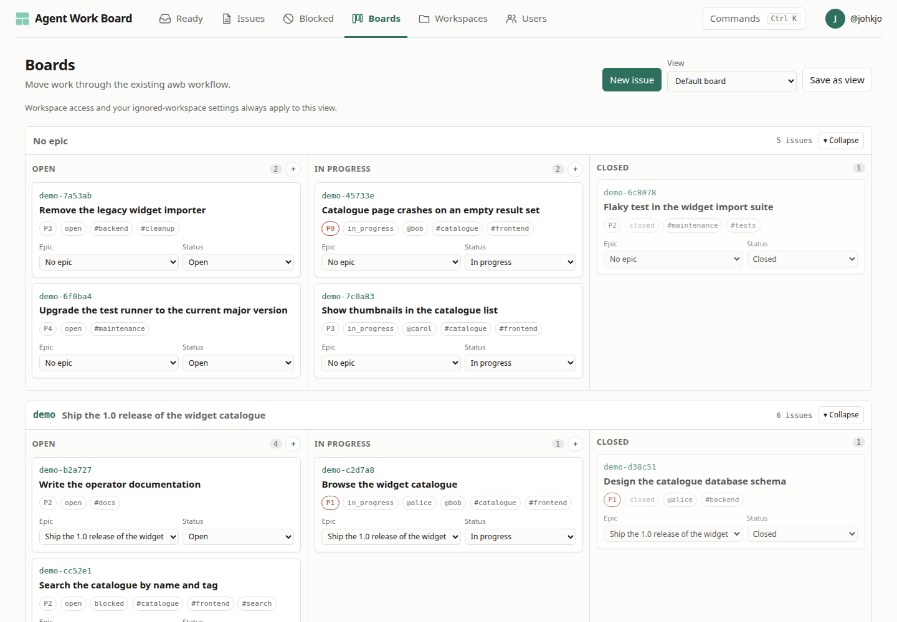
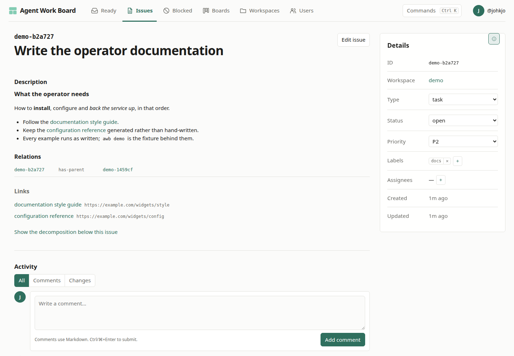

# Web UI

The bundled web UI is the human surface for the same backend the CLI uses. It
is compiled into the awb binary and served by `awb serve`; there is no separate
web deployment to install.

```console
awb serve
```

Open <http://127.0.0.1:7777/>.

## Boards



The default board groups work into epic swimlanes and the three fixed workflow
columns. A “No epic” lane keeps standalone work visible. From the board you can:

- create an issue directly in a lane and status;
- move cards between statuses and epics;
- order work by dragging cards on wider screens;
- edit a card's status and epic with accessible controls;
- collapse lanes while retaining that preference locally;
- filter by workspace, epic, label, assignee, and priority;
- save a named view and optionally share it with anyone who can access its
  underlying issues.

Moving to open may clear assignees and closing changes lifecycle state, so the
UI confirms the consequences before applying them. Board moves are one atomic
backend operation: status, epic relation, and manual position cannot partially
apply.

Saved views store filters, not issue copies. Workspace authorization and each
user's ignored-workspace preferences still apply when another user opens a
shared link.

## Issue pages



An issue page combines the work record and its collaboration stream:

- rendered Markdown description with extracted links;
- type, status, priority, labels, and assignees;
- dependency and parent relations;
- attachment metadata and downloads;
- comments and structured change activity;
- a link to the issue's decomposition tree.

Edit mode uses a Markdown editor with preview and autocomplete for labels,
assignees, and relation targets. Updates use entity versions so a stale browser
does not silently overwrite a concurrent change.

## Lists and discovery

Ready, issues, and blocked pages mirror their CLI listings. Filters live in the
URL, so a scoped list can be bookmarked or shared. Pagination keeps both the
result set and facet selectors bounded for large databases.

Full-text search finds issues by title and description. The global command
palette also searches addressable records and provides keyboard navigation to
common actions. Open it with `Ctrl+K` on Linux and Windows or `⌘K` on macOS.

## Workspaces and accounts

The workspace pages show descriptions, counts, members, and lifecycle state.
Authorized users can edit metadata, manage access, archive a workspace into
read-only history, restore it, or explicitly delete it.

The account area shows the current user's profile and workspace access. User
and workspace administrators get the additional controls their capabilities
allow; ordinary users do not receive unusable administration actions.

Each user can ignore otherwise-visible workspaces. Ignored work disappears from
normal navigation, lists, search, facets, and boards, while a dedicated settings
view remains able to find and restore it. This is a personal preference, not an
authorization boundary.

## Responsive and keyboard use

The UI adapts from desktop boards and tables to narrow screens. At widths where
precise drag placement is not practical, explicit select controls remain
available. Dialogs, autocomplete, board controls, and the command palette expose
keyboard and screen-reader semantics; the browser test suite pins down the core
flows.

For remote access and user permissions, continue with
[Server and API](server.md).
